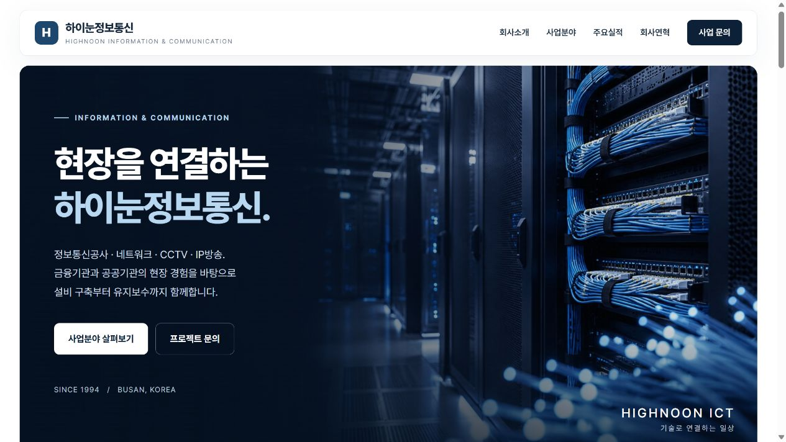

# 하이눈정보통신 기업소개 홈페이지

## 홈페이지 바로가기

**[하이눈정보통신 홈페이지 열기](https://kclock-boop.github.io/hinoonict/)**

KT 협력사 하이눈정보통신의 정보통신공사, 네트워크, CCTV, IP방송과 유지보수 사업을 소개합니다.
밝은 화이트·블루 디자인으로 회사소개 · 사업분야 · 주요실적 · 현장사진 · 회사연혁 · 문의 안내를 PC와 모바일에서 확인할 수 있습니다.

## 홈페이지 구성

- [회사소개 및 홈페이지 파일](./index.html)
- [메인 통신설비 작업 사진](./assets/telecom-construction.jpg)
- [네트워크 유지보수 이미지](./assets/network-maintenance.jpg)
- [사용자 제공 현장사진](./assets/field-safety-meeting.png)
- [내용 출처와 제작메모](./제작메모.txt)

## 자료 기준

회사 기본정보, 연락처, 연혁과 실적은 제공된 회사 지명원을 기준으로 작성했습니다.
메인 사진은 Field Engineer가 Pexels에 공개한 통신설비 작업 사진입니다. 하이눈정보통신의 실제 직원 또는 현장 사진을 의미하지 않습니다. 유지보수 이미지는 AI 생성 이미지입니다.
H 문자 표식은 공식 로고를 대신한 임시 표식입니다.
원본 PDF와 개인별 훈련 정보는 저장소에 포함하지 않습니다.

수정일: 2026-10-02
KT 기업소개: https://corp.kt.com/html/intro/main.html

사진 출처: https://www.pexels.com/photo/electronics-engineer-fixing-cables-on-server-442150/
사용조건: https://www.pexels.com/license/

## 관련 링크

- [국가직무능력표준](https://www.ncs.go.kr/index.do)
